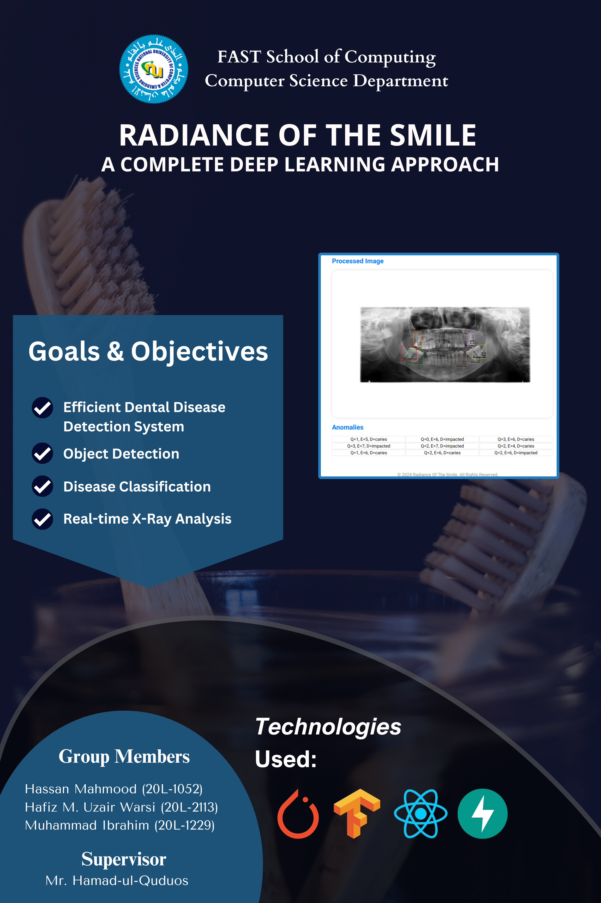

# Radiance Of The Smile: A Complete Deep Learning Approach

## Introduction
**ROTS** is an innovative solution designed to provide dentists with actionable insights through advanced teeth detection and disease classification. Utilizing modern Object Detection Models and Transfer Learning, this platform aims in easing manual X-Ray analysis significantly.

## Technologies Used
- **Backend:** FASTAPI
- **Frontend:** ReactJS
- **Object Detection and Classification:** YOLOv8 and DenseNet121

## Features
- Upload/Remove Image
- Quadrant and Teeth Detection
- Detailed 5 category classification for all teeth
- Download Processed Image

## Poster

  

## Getting Started

### Installation
Check the backend and the frontend repositories for installation

## Authors
- [Muhammad Ibrahim](https://www.linkedin.com/in/mibrahim39/)
- [Hassan Mahmood](https://www.linkedin.com/in/ihassanmahmood/)
- [Hafiz Uzair Warsi](https://www.linkedin.com/in/hafiz-uzair/)
  
## Acknowledgments
Thanks to [Mr. Hamad Ul Qudous](https://www.linkedin.com/in/hamad-ulqudous-3a2a4869/) for supervising the project.